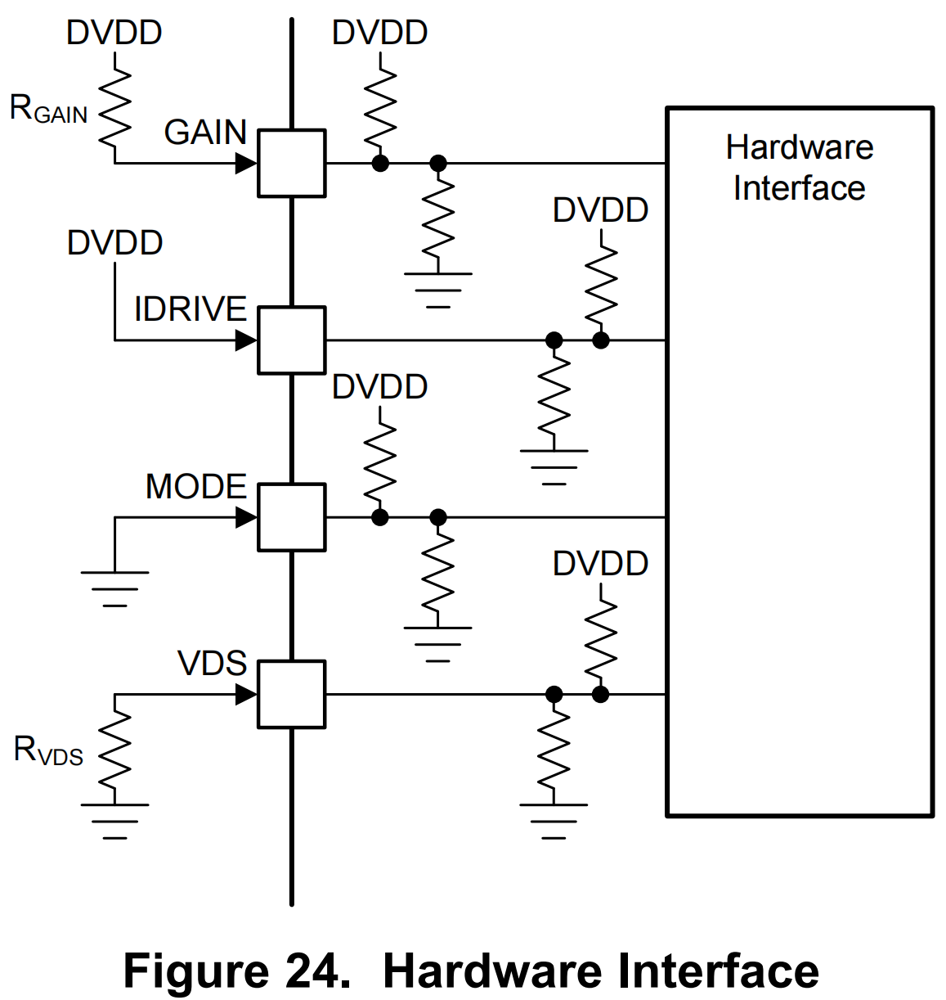
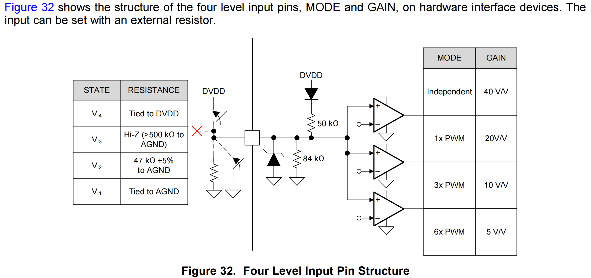
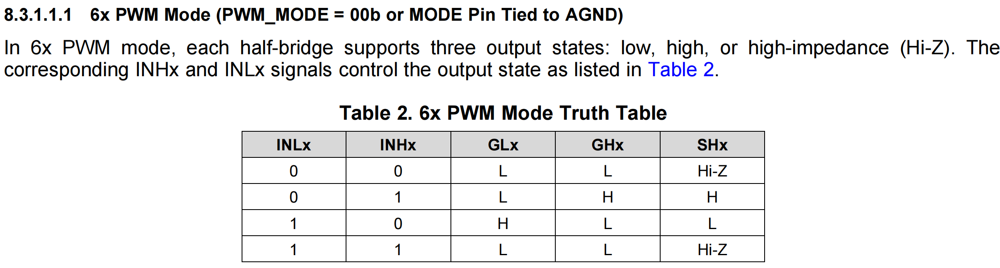
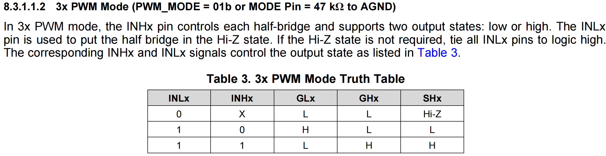
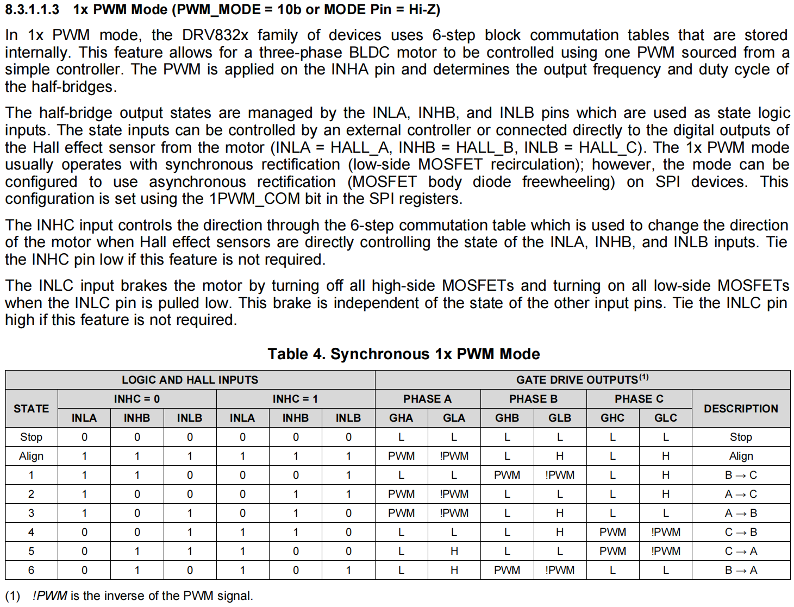
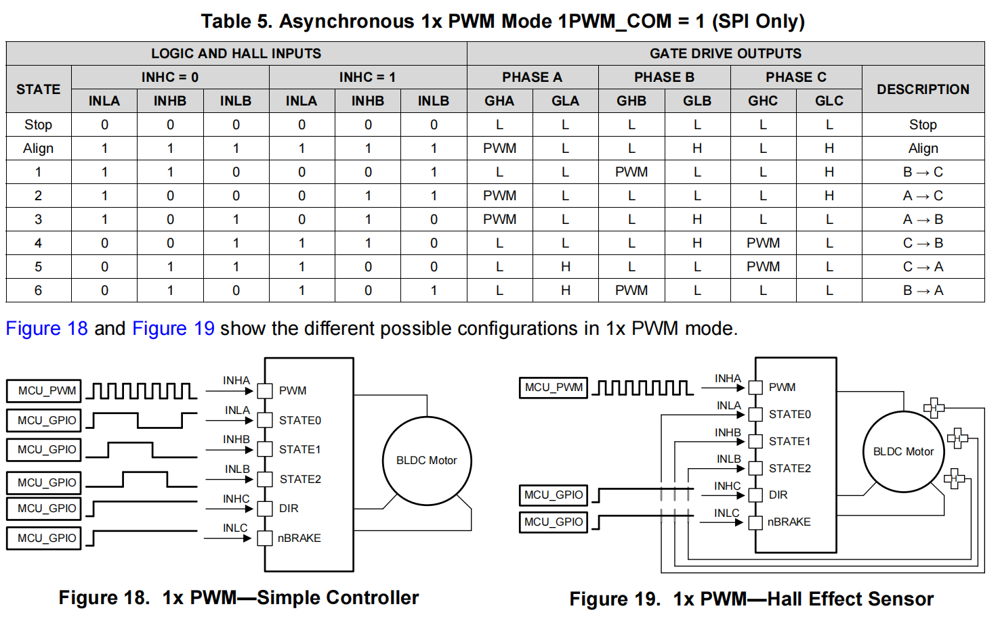
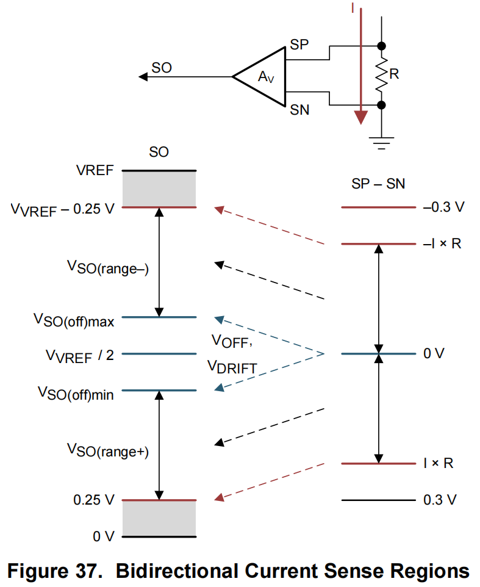
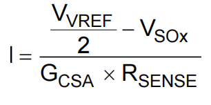
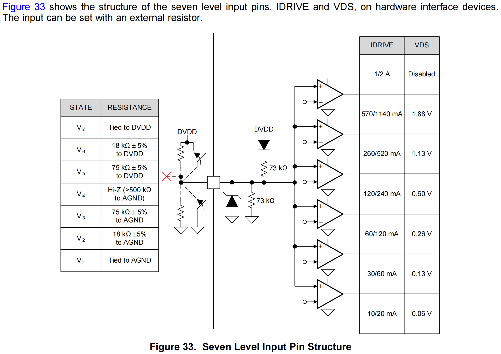
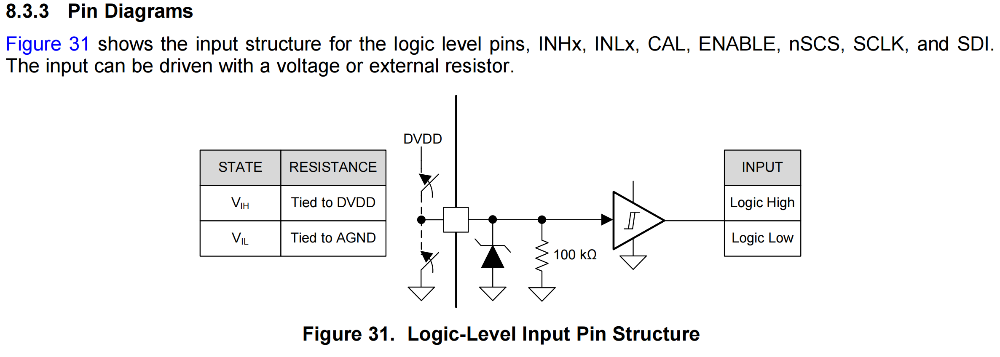

# FOC-DRV8323

**基于DRV8323HRTAR的FOC驱动器**

**DRV8323HRTAR-based FOC driver**

DRV8323HRTAR芯片从属于德州仪器TI公司的DRV832x芯片系列

The DRV8323HRTAR chip is part of Texas Instruments TI's DRV832x chip family.

相较于DRV8323、DRV8323R和DRV8323S，DRV8323H系列通过外部引脚的1-level、4-level和7-level式的外接电阻决定部分芯片功能，具体如下：

Compared to the DRV8323, DRV8323R and DRV8323S, the DRV8323H series determines some of the chip functions through external resistors of 1-level, 4-level and 7-level type on external pins as follows:

### 4-level

[*手册 Page 40*](Doc/drv8323.pdf)

本项目使用的DRV8323HRTAR芯片的采样增益引脚GAIN和PWM模式控制引脚MODE均采用4-level接线，由图中可知，Vi1,Vi2,Vi3,Vi4分别对应引脚直连AGND、接47kΩ(±5%)电阻到AGND、高阻态（接500kΩ以上的大电阻到AGND）以及直连DVDD；而Vi1,Vi2,Vi3,Vi4对于MODE引脚和GAIN引脚有又分别对应其四个不同的模式：

| 4-level            | MODE        | GAIN  |
| ------------------ | ----------- | ----- |
| 直连DVDD             | Independent | 放大40倍 |
| 高阻态/接>500kΩ电阻到AGND | 单路PWM       | 放大20倍 |
| 接47kΩ电阻到AGND       | 3路PWM       | 放大10倍 |
| 直连AGND             | 6路PWM       | 放大5倍  |

The sampling gain pin GAIN and PWM mode control pin MODE of the DRV8323HRTAR chip used in this project are wired in 4-levels, and it can be seen from the figure that Vi1,Vi2,Vi3,Vi4 correspond to the pins directly connected to AGND, connected to a 47kΩ (±5%) resistor to AGND, and a high-resistance state (connected to a large resistor of 500kΩ or more to the Vi1, Vi2, Vi3 and Vi4 correspond to four different modes for MODE and GAIN pins respectively:

| 4-level            | MODE        | GAIN  |
| ------------------ | ----------- | ----- |
| DVDD             | Independent | Magnification 40x |
|High resistance state/connect >500kΩ resistor to AGND | Single PWM | Magnification 20x |
| Connect 47kΩ resistor to AGND.       | 3-Channel PWM       | Magnification 10x |
| Directly connected to AGND             | 6-Channel PWM      | Magnification 5x  |

#### PWM MODE

[*手册 Page 31*](Doc/drv8323.pdf)

在6路PWM模式下，通过外部控制器能够实现每路PWM独立控制一个MOS管；由于PWM输入存在死区，为保证实现精确控制，应当在微控制器中加入死区补偿代码。

需要将MODE引脚连接到AGND实现6路PWM控制。

In 6-channel PWM mode, through the external controller can realize each channel PWM independent control of a MOS tube; due to the existence of the dead zone of the PWM input, in order to ensure the realization of accurate control, should be added to the microcontroller dead zone compensation code.

The MODE pin needs to be connected to AGND to realize 6-channel PWM control.

[*手册 Page 31*](Doc/drv8323.pdf)

在3路PWM模式下，每路PWM可以控制一组半桥（即两个MOS管），当INLx设置为高电平时，通过INHx的PWM输入能够使得半桥上下两个MOS管的交替开关；这一模式能够较好地适用于FOC电机控制，即能够便捷的实现SVPWM，同时节省了IO口。

需要将MODE引脚连接47kΩ电阻到AGND

In 3-channel PWM mode, each PWM  can control a group of half-bridges (i.e., two MOS tubes), when INLx is set to high level, the PWM input through INHx can make the upper and lower half-bridges alternate switching of the two MOS tubes; this mode can be better suited to the FOC motor control, i.e., it can conveniently realize the SVPWM, and at the same time, save the IO port.

Need to connect 47kΩ resistor from MODE pin to AGND

[*手册 Page 31-32*](Doc/drv8323.pdf)

单PWM模式适用于对无刷电机的六步换向控制，仅需INHA提供PWM输入，余下5个接口使用GPIO输入即可；在Figure19中，通过霍尔传感器的电平变化作为INLA、INHB和INLB的输入，有效简化了控制输入。

The single PWM mode is suitable for six-step commutation control of brushless motors, which only requires INHA to provide PWM inputs, and the remaining five interfaces can be used with GPIO inputs; in Figure19, the control inputs are effectively simplified by using the level change of Hall sensors as the inputs of INLA, INHB and INLB.

#### GAIN

[*手册 Page 41-42*](Doc/drv8323.pdf)

DRV8323H的电流采样如图，通过改变GAIN引脚的外接电阻可以改变采样增益。

The current sampling of the DRV8323H is shown in the figure, and the sampling gain can be varied by changing the external resistance of the GAIN pin.

### 7-level

level

[*手册 Page 40*](Doc/drv8323.pdf)

IDRIVE和VDS引脚采用7-level接线，通过芯片内的比较器选择不同模式：

| 7-level            | IDRIVE                  | VDS         |
| ------------------ | ----------------------- | ----------- |
| 直连DVDD             | IG peak/sink：1/2A       | 不使能         |
| 接18kΩ电阻到DVDD       | IG peak/sink：570/1140mA | D-S阈值：1.88V |
| 接75kΩ电阻到DVDD       | IG peak/sink：260/520mA  | D-S阈值：1.13V |
| 高阻态/接>500kΩ电阻到AGND | IG peak/sink：120/240mA  | D-S阈值：0.6V  |
| 接75kΩ电阻到AGND       | IG peak/sink：60/120mA   | D-S阈值：0.26V |
| 接18kΩ电阻到AGND       | IG peak/sink：30/60mA    | D-S阈值：0.13V |
| 直连AGND             | IG peak/sink：10/20mA    | D-S阈值：0.06V |

IDRIVE用于设置MOS管的源极驱动电流，VDS用于检测MOS管漏极和栅极之间的电压。

The IDRIVE and VDS pins are 7-level wired to select different modes via an on-chip comparator:

| 7-level            | IDRIVE                  | VDS         |
| ------------------ | ----------------------- | ----------- |
| To DVDD             | IG peak/sink：1/2A       | Disable         |
| Connect 18kΩ resistor to DVDD      | IG peak/sink：570/1140mA | D-S thresholds: 1.88V |
| Connect 75kΩ resistor to DVDD       | IG peak/sink：260/520mA  | D-S thresholds: 1.13V |
| High resistance state/connect >500kΩ resistor to AGND | IG peak/sink：120/240mA  | D-S thresholds: 0.6V  |
| Connect a 75kΩ resistor to AGND.       | IG peak/sink：60/120mA   | D-S thresholds: 0.26V |
| Connect a 18kΩ resistor to AGND.       | IG peak/sink：30/60mA    | D-S thresholds: 0.13V |
| To AGND             | IG peak/sink：10/20mA    | D-S thresholds: 0.06V |

IDRIVE is used to set the source drive current of the MOS tube and VDS is used to detect the voltage between the drain and gate of the MOS tube.

### 1-level

[*手册 Page 39*](Doc/drv8323.pdf)

1-level适用于芯片的数字引脚，经过比较器后得到逻辑高电平和低电平输入到芯片。

The 1-level applies to the digital pins of the chip, which are passed through a comparator to get logic high and low levels for input to the chip.

## *硬件已开源*
## *Hardware is Open Sourced*
